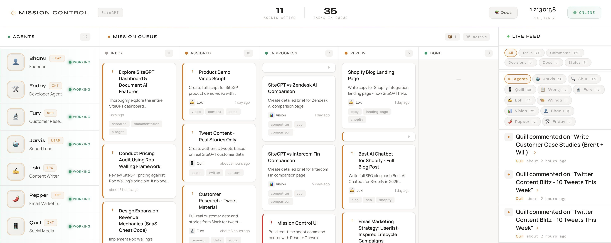

# UI Mockup

Visual reference for the Mission Control dashboard.

## Reference Image

*Source: [@pbteja1998's tweet](https://x.com/pbteja1998/status/2017662163540971756)*

---

## Key Visual Elements

### 1. Header
- Project logo on the left
- Theme toggle (light/dark)
- User avatar on the right

### 2. Board Switcher
- Horizontal tabs or dropdown
- Each board has icon + name
- Active board highlighted

### 3. Kanban Columns
- 5 columns: Backlog, To Do, In Progress, Review, Done
- Column headers with task count
- Cards stack vertically
- Drag handles visible on hover

### 4. Task Cards
- Rounded corners, subtle shadow
- Priority color band on left edge
- Title, tags, assignee avatar
- Comment and attachment counts

### 5. Agent Sidebar
- Fixed on right side (desktop)
- Agent avatars with status indicator (green/yellow/gray dot)
- Click to see agent details

### 6. Live Activity Feed
- Bottom section or collapsible panel
- Recent events with timestamps
- Icons for different action types

---

## Color Palette

| Element | Light Mode | Dark Mode |
|---------|------------|-----------|
| Background | #f5f5f5 | #1a1a2e |
| Card | #ffffff | #16213e |
| Primary | #6366f1 | #818cf8 |
| Success | #10b981 | #34d399 |
| Warning | #f59e0b | #fbbf24 |
| Danger | #ef4444 | #f87171 |

## Typography

- Headers: Inter or Outfit (Google Fonts)
- Body: System UI stack
- Code: JetBrains Mono or Fira Code
